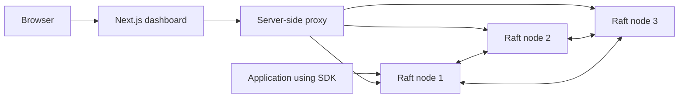

# QFlag

QFlag is a self-hosted feature flag system.

It lets you turn features on or off, release a feature to a percentage of users, target specific users, and roll back a change. Flag data is copied across three Go servers with the Raft consensus algorithm.

The repository contains:

- a Go backend and Raft key-value store
- a Next.js dashboard
- a TypeScript SDK
- a Docker Compose setup for a three-node cluster

## What problem does it solve?

A feature flag lets you change application behavior without deploying new code.

For example, you can:

- enable a new checkout for 10% of users
- give early access to selected user IDs
- turn a broken feature off immediately
- restore an older flag version
- keep serving flags when one server stops

## Main features

- Three-node Raft cluster
- Automatic leader election
- Flag create, read, update, delete, and rollback APIs
- Percentage rollout from 0% to 100%
- Exact user targeting
- Version history and audit history
- Dark and light dashboard themes
- TypeScript SDK with caching and safe defaults
- Health and Prometheus-style metrics endpoints
- API and Raft transport tokens

## System design



### The three backend nodes

The backend normally runs as three nodes. At any time:

- one node is the **leader**
- two nodes are **followers**

The leader accepts flag operations. Followers copy the leader's log and are ready to replace it.

A **quorum** means most nodes agree. In a three-node cluster, quorum is two nodes.

### What happens when a flag changes?

1. The dashboard or API client sends the change to a backend node.
2. If that node is a follower, it returns `409 Conflict` with leader information.
3. The client tries another configured node.
4. The leader validates the request.
5. The leader adds the flag change, version data, and audit record to one Raft log entry.
6. The leader copies that entry to the followers.
7. The change is committed after at least two of the three nodes have stored it.
8. Each node applies the committed entry to its local key-value store.
9. The leader returns success to the client.

This prevents one node from accepting a change that the cluster has not agreed on.

### What happens when a flag is evaluated?

The backend follows these rules in order:

1. If the user ID is in `targetUsers`, return `true`.
2. If the flag is disabled, return `false`.
3. Put the user into a stable bucket from 0 to 99.
4. Return `true` when the bucket is below the rollout percentage.

The bucket uses both the user ID and flag name. The same user stays in the same bucket for the same flag.

The SDK can cache flags and evaluate them locally. When it cannot reach any backend node, it returns the default value supplied by the application.

### What happens when a node fails?

- If a follower fails, the leader and the other follower still form a quorum.
- If the leader fails, the followers hold an election and choose a new leader.
- If only one node is available, the cluster cannot commit writes because it has no quorum.

Each node saves its Raft term, vote, log, commit position, and key-value data to a JSON file in its data directory. The node reads this file when it starts again.

### How the dashboard connects

The browser does not call the Go API directly. It calls a Next.js server route. That route adds the API token and tries the configured backend nodes.

This keeps the backend token out of browser JavaScript. The dashboard itself does not include user login. Put it behind an authenticated reverse proxy before exposing it to the internet.

## Repository layout

| Path | Purpose |
| --- | --- |
| `services/qflag` | Go API, flag service, Raft node, and storage |
| `apps/dashboard` | Next.js dashboard and server-side API proxy |
| `packages/sdk` | TypeScript flag evaluation SDK |
| `docker-compose.yml` | Local three-node cluster and dashboard |
| `.github/workflows/ci.yml` | GitHub test and build checks |

## Quick start with Docker

### Requirements

- Docker with Docker Compose
- Two different secret values

Set the secrets in PowerShell:

```powershell
$env:API_TOKEN = "replace-with-a-long-random-api-token"
$env:RAFT_TOKEN = "replace-with-a-different-long-random-raft-token"
```

Start everything:

```bash
docker compose up --build
```

Open the dashboard at `http://localhost:3000`.

The backend nodes are available at:

- `http://localhost:8081`
- `http://localhost:8082`
- `http://localhost:8083`

Stop the services:

```bash
docker compose down
```

Docker volumes keep the cluster data. Use `docker compose down --volumes` only when you want to delete all flag data.

## API examples

All `/api/v1` requests require the API token.

Create a flag:

```bash
curl --request POST http://localhost:8081/api/v1/projects/acme/env/production/flags \
  --header "Authorization: Bearer $API_TOKEN" \
  --header "Content-Type: application/json" \
  --data '{"flagName":"checkout-v2","enabled":true,"rolloutPercentage":10,"targetUsers":[]}'
```

Evaluate the flag for one user:

```bash
curl --header "Authorization: Bearer $API_TOKEN" \
  "http://localhost:8081/api/v1/projects/acme/env/production/flags/checkout-v2/evaluate?userId=user-42&default=false"
```

Read cluster status:

```bash
curl --header "Authorization: Bearer $API_TOKEN" \
  http://localhost:8081/api/v1/cluster/status
```

Read metrics:

```bash
curl http://localhost:8081/metrics
```

## TypeScript SDK

```ts
import { QFlag } from "@qflag/sdk";

const flags = new QFlag({
  endpoints: [
    "http://localhost:8081",
    "http://localhost:8082",
    "http://localhost:8083",
  ],
  projectId: "acme",
  environment: "production",
  apiToken: process.env.API_TOKEN,
});

const enabled = await flags.isEnabled("checkout-v2", "user-42", false);
```

Keep the API token on a trusted server. Do not place it in browser code.

## Local development

You need:

- Node.js 20 or newer
- npm
- Go 1.23 or newer

Install dependencies:

```bash
npm install
```

Run one backend node in PowerShell:

```powershell
cd services/qflag
$env:API_TOKEN = "local-api-token"
$env:RAFT_TOKEN = "local-raft-token"
go run ./cmd/qflag
```

Run the dashboard in another PowerShell window:

```powershell
$env:API_TOKEN = "local-api-token"
$env:QFLAG_NODES = "http://localhost:8081,http://localhost:8082,http://localhost:8083"
npm run dev:dashboard
```

Run every check:

```bash
npm run check
```

This command runs linting, TypeScript tests, Go tests, type checks, and production builds.

## Configuration

| Variable | Required | Default | Meaning |
| --- | --- | --- | --- |
| `API_TOKEN` | Yes | None | Token for the HTTP API |
| `RAFT_TOKEN` | Backend only | None | Token used between Raft nodes |
| `NODE_ID` | No | `node-1` | Unique node name |
| `HTTP_ADDR` | No | `:8080` | Address the node listens on |
| `PUBLIC_URL` | No | Built from `HTTP_ADDR` | Address shared with other nodes |
| `DATA_DIR` | No | `./data/<node-id>` | Folder used for saved node state |
| `PEERS` | No | Empty | Comma-separated `node-id=url` list |
| `CORS_ALLOWED_ORIGINS` | No | `http://localhost:3000` | Browser origins allowed by the API |
| `QFLAG_NODES` | Dashboard only | None | Comma-separated backend URLs |

## Contributing

Pull requests are welcome.

1. Keep the change focused.
2. Add tests when behavior changes.
3. Run `npm run check`.
4. Explain what changed and why.

Use a short conventional commit message, such as `fix: retry evaluation across nodes`.

## License

QFlag is licensed under the [Apache License 2.0](LICENSE).
